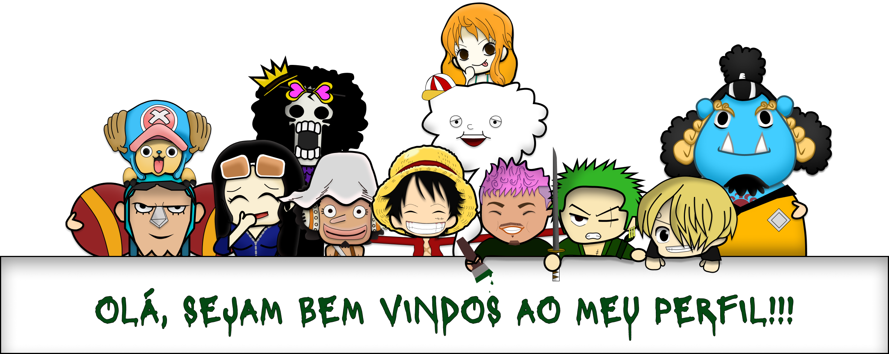

  

 

 um entusiasta de tecnologia, desenvolvedor web júnior e estudante de UX Design em busca de desafios empolgantes para impulsionar minha carreira. Com sólida formação em Desenvolvimento web na Trybe, estou dedicado a transformar códigos em soluções incríveis. 

- 👨‍💻 Desenvolvedor Web / Web Development
- 👦🏽 Pronouns: Ele/Dele / He/Him
-  Email: riquebrunotrabalhos@gmail.com
-  Linkedin: <a href="https://www.linkedin.com/in/bruno-h-cardoso/">bruno-h-cardoso</a>

##
  
  

  

##
 <h2 align="center">🏴‍☠️ Habilidades & Ferramentas 🏴‍☠️</h2>

  

 
 
 

##
 <h2 align="center">📜 Certificates / Certificados 📜</h2>
  

    -----
    
    -----
    
    -----
  

 
 
 

##

  

